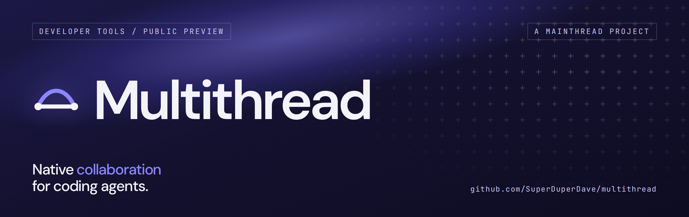

<p align="center"></p>

# Multithread

**Native collaboration for coding agents.**

A Mainthread project · [Project page](https://mainthread.ai/work/multithread/)

Give your work additional threads while keeping its purpose, ownership, and
results connected.

Multithread lets coding agents coordinate across sessions and Git worktrees.
Either Codex or Claude can call a native peer for a scoped task, receive its
answer and continue working.
A durable local ledger keeps resource claims, commit-backed handoffs and explicit
acknowledgements available across interruptions.

- Call Claude or Codex through your existing provider installations and sign-ins,
  and send updates while a peer is running.
- Claim shared resources with exact ownership that survives interrupted sessions.
- Hand off an immutable Git commit and keep it pending until acknowledged.
- Recover pending work after a restart; notifications and reads never consume it.

This is a preview with [scoped native evidence](docs/PEER-REFERENCE.md#coordination-and-verification-scope)
and [hosted checks](docs/CI.md) at their recorded revisions. These observations
do not establish fresh-account onboarding or broader platform support.
The commands below use the current published `multithread` entry point. See
[compatibility](docs/SETUP.md#compatibility) for older releases and the retained
`relay` command from the former Agent Relay name.

[MIT licensed](LICENSE), copyright (c) 2026 David Jones. Created by David Jones
with AI assistance: Codex contributed implementation, testing and release work;
Claude contributed native review.

## Install for your project

Use an ordinary **x86-64 Linux** account with Python 3.12 at `/usr/bin/python3`,
Git at `/usr/bin/git`, Landlock ABI3+, procfs and supported filesystem birth times.
WSL2 with ext4 is the exercised profile. See [support](docs/SUPPORT.md).
Use your existing, functioning Codex/Claude installation and provider access;
Multithread does not provision them.

From the Git repository you want to use, run this publisher's installer:

```sh
multithread_setup=$(mktemp) &&
  curl -fsSL --proto '=https' \
    https://github.com/SuperDuperDave/multithread/releases/latest/download/install.py \
    -o "$multithread_setup" &&
  /usr/bin/python3 -I -S -B "$multithread_setup" --enroll-repo "$PWD"
```

Trust and review the [publisher and release](https://github.com/SuperDuperDave/multithread/releases/latest)
before running its code. The installer verifies its pinned package, shows the
selected release and repository scope, and asks you to type `install` once.
Checksums bind the selected bytes; they are not publisher signatures.
It installs account-local code, explicitly enrolls this project and prints
readiness and exact next commands. A matching healthy installation is reused.
Provider sign-ins, settings and permissions stay unchanged.

Or give your coding agent the [setup prompt](docs/SETUP.md#ask-your-coding-agent).
It covers installation, enrollment and launch preparation without requiring a
Multithread source checkout. Continue below with native trust review and one
collaboration. The [setup guide](docs/SETUP.md) also covers pinned versions,
partial setup and updates.

Check readiness again at any time:

```sh
~/.local/bin/multithread setup --repo "$PWD" --check
```

This is read-only. It distinguishes runtime/repository readiness from prepared
or missing providers. Authentication, hook delivery and provider tools remain
unchecked until observed in a native session.

## Collaborate

First, complete any required [native sign-in and trust review](docs/SETUP.md#review-native-trust)
through the provider's normal interface. To start an interactive Codex or Claude
session with Multithread hooks, use the exact launch command printed by setup, or:

```sh
~/.local/bin/multithread launch codex --repo "$PWD"
```

Use `claude` for the other provider. Review the invocation and type `launch`;
adding `--json` prepares the plan without starting a session.

Then give your agent the copyable [first-collaboration prompt](docs/PEER.md#first-collaboration).
It authorizes one scoped, read-only native review and asks the caller to assess
the returned findings. Calls use normal provider permissions and existing access;
provider configuration determines the billing path. A peer call's `--json`
**does execute the call**; use its `--dry-run` to inspect first.

Read the [result and any unresolved work](docs/PEER.md#read-the-result-before-continuing)
before continuing. If another call is warranted and authorized, use the
[exact returned native session](docs/PEER.md#follow-up-in-the-same-native-session)
for a deliberate follow-up in the same checkout. A returned answer alone does
not establish a completed review.

A thread is a separately scoped agent workstream; the main thread carries the
continuing objective. You might ask an agent to “multithread this investigation”
or “use up to three additional threads.” These are plain-language instructions
about intent and capacity, with a ceiling rather than a quota. They are not CLI
commands or a built-in scheduler; execution depends on available tools, supported
providers and authorized use.

Collaboration is optional unless your task requires it. It can help with a
critical change, a stalled investigation or a design that still misses the
intended look and feel. [Choose the contribution and how to assess it](docs/PEER.md#choose-the-contribution-you-need).

For ongoing projects, the optional [Multithread skill](skills/multithread/SKILL.md)
helps an agent discover when and how to use the installed system. Add it to a
provider's project-local skill location only if you want that guidance available
there; [setup explains the locations](docs/SETUP.md#ask-your-coding-agent).

The [manual two-worktree walkthrough](docs/PROVIDERS.md#try-a-review-across-two-worktrees)
remains available for separate sessions with manual wakes and explicit Git work.

## Update

```sh
~/.local/bin/multithread update
```

The updater checks the published release and asks once before applying a new
selection. Use `--check` or `--json` to inspect without applying; the JSON result
provides an exact command for an authorized agent to apply an available update.
Updates are explicit, with no background updater. See
[update details](docs/SETUP.md#update-an-existing-installation) for active work,
version selection and rollback.

## Try the no-account demo

The optional demo uses scripts and real SQLite without provider accounts or an
existing Multithread installation. It reproduces a bug, commits a fix, recovers a
missed handoff after restart, rejects conflicting claims and reviews the exact
commit in another worktree. It ends with
`PASS: 6 real ledger events; SQLite integrity ok.`

Clone and review the source, then run from its root:

```sh
git clone https://github.com/SuperDuperDave/multithread.git
cd multithread
/usr/bin/python3 -I -S -B examples/no_account_demo.py
```

The demo additionally requires Bubblewrap at `/usr/bin/bwrap` and enabled
rootless/nested namespaces. These are extra demo/test prerequisites. See the
[demo guide](docs/DEMO.md) for isolation and expected output.

## Further reading

Multithread coordinates cooperating agents under one trusted local OS account. Claims
do not grant permissions, and acknowledgement records consumption rather than
approval to merge or deploy. Failed state access is unknown state; claims have
no automatic expiry. Native Windows, macOS, ARM Linux and cross-machine
coordination are outside the exercised profile.

- [Setup and readiness](docs/SETUP.md)
- [Architecture and tradeoffs](docs/ARCHITECTURE.md)
- [Offline installation, source builds and rollback](docs/engineering/INSTALLATION.md)
- [Code uninstall](docs/engineering/UNINSTALL.md) and [repository rebind](docs/engineering/REBIND.md)
- [Supported environments and troubleshooting](docs/SUPPORT.md)
- [CI and checkout verification](docs/CI.md)
- [Release acceptance requirements](docs/engineering/REQUIREMENTS.md)
- [Publication checks and evidence boundaries](docs/engineering/PUBLICATION.md)
